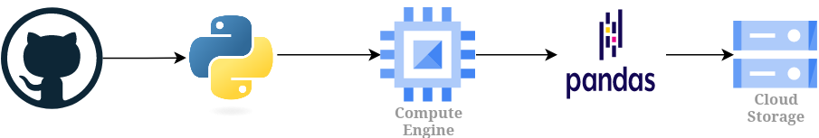

# etl-github-api

## **Sobre**

Este projeto cria um processo simples de ingestão no Google Cloud Storage com dados dos projetos mais bem avaliados (com mais estrelas) do Github que usam Rust ou C ou Assembly. Os dados dos projetos foram obtidos por meio do consumo da **API do Github**, manipulados utilizando **pandas** e salvos no Cloud Storage em formato **csv**. O processo foi executado através de uma máquina virtual no **Google Compute Engine**.

## **Ferramentas**

- [Google Cloud Storage](https://cloud.google.com/storage?hl=pt-br)
- [Google Compute Engine](https://cloud.google.com/compute), com uma máquina do tipo [e2-micro](https://cloud.google.com/compute/docs/general-purpose-machines#e2_machine_types) e com [debian](https://cloud.google.com/compute/docs/images/os-details#general-info) instalado.
- [Python](https://www.python.org/) (Versão: 3.11)
- [Pandas](https://pandas.pydata.org/) (Versão: 2.1)
- [Requests](https://requests.readthedocs.io/en/latest/) (Versão: 2.31)
- [API Github](https://docs.github.com/en/rest)


## **Data Pipeline**



## **Utilização**

Para executar o processo pode-se utilizar uma instância do Cloud Shell ou executar localmente por meio do [Google Cloud CLI](https://cloud.google.com/sdk/docs/install?hl=pt-br), e seguir os passos:

1. Alterar o arquivo de configuração `config.json`:
    - `"bucket_name"`:   Colocar o nome do bucket desejado;
    - `"target_folder"`: Colocar o nome do diretório de destino (pode deixar como `null` ou vazio `""`);
    - `"csv_file_name"`: Colocar o nome do arquivo csv.

2. Dar permissão para execução do arquivo `main.sh`:

    ```Bash
    chmod +x main.sh
    ```

3. Executar o arquivo `main.sh` com os parâmetros para o nome da VM (`VM_NAME`), id do projeto (`PROJECT_ID`) e a zona da VM (`ZONE`). Exemplo:

    ```Bash
    ./main minha_vm meu-project-id us-central1-b
    ```

**OBS.:** Para esse projeto serão instaladas as bibliotecas `requests`, `pandas` e `gcsfs` na VM via `pip` (`dependencies.sh`), logo após a criação da instância da VM.